# Prompt-Inversion Results - Text-only LLM (multi-seed)

Run: `students/outputs/20260607-152239_ollama_refine_seeds` | model: `llama3.1:8b` | optimiser seeds: [0, 1, 2] (LCM render seed fixed per target filename).

**Metrics** (image-level, target vs rendered): CLIP image-image cosine similarity via `ViT-L-14/openai` (= `openai/clip-vit-large-patch14`, higher better); LPIPS AlexNet (lower better); pixel RMSE (lower better). **Objective** = CLIP - LPIPS - RMSE.

## Test-set summary (mean +/- std)

Across the full test set, over the best candidate of each (target x seed), n = 18 (6 targets x 3 seeds).

| Metric | Mean | Std |
|---|---|---|
| CLIP (up) | +0.8270 | 0.1106 |
| LPIPS (down) | +0.5090 | 0.0517 |
| RMSE (down) | +0.1813 | 0.0201 |
| Objective (up) | +0.1367 | 0.1401 |

### Per-seed test-set means (robustness across optimiser seeds)

| Seed | CLIP | LPIPS | RMSE | Objective |
|---|---|---|---|---|
| 0 | 0.825 | 0.502 | 0.184 | +0.138 |
| 1 | 0.837 | 0.514 | 0.180 | +0.143 |
| 2 | 0.820 | 0.511 | 0.179 | +0.129 |

## Vision LLM variant (ablation)

We also implemented a vision variant in which the refinement LLM (`llava`)
additionally *sees* the target image and the current render, rather than only
reading the metric-feedback string. A single-seed run over the 6 targets gave:

| System | CLIP (up) | LPIPS (down) | RMSE (down) | Objective (up) |
|---|---|---|---|---|
| Text-only (`llama3.1:8b`, 3 seeds, n=18) | 0.827 | 0.509 | 0.181 | +0.137 |
| Vision (`llava`, 1 seed, n=6) | 0.830 | 0.495 | 0.168 | +0.167 |

The vision model was marginally better on the perceptual/pixel metrics
(LPIPS, RMSE) and on the objective, but the gap (~0.03 objective) is **within
the text model's seed-to-seed variation** (std ≈ 0.14), i.e. not statistically
meaningful. It also cost ~3-4 s extra per iteration: the Ollama vision runner
had to be unloaded and reloaded on every call to work around a prompt-cache
crash with multimodal inputs. Given the negligible quality gain against the
higher cost and instability, we focus on the **text-only** system below.

## Per-target results

### 1159_25.png

<table><tr>
<td align="center"><b>Target</b> </td>
<td align="center"><b>#1</b> 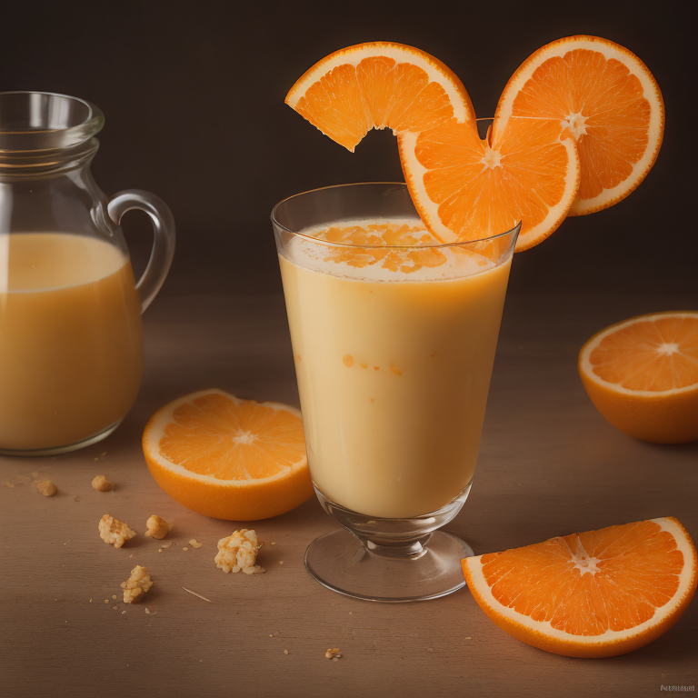</td>
<td align="center"><b>#2</b> 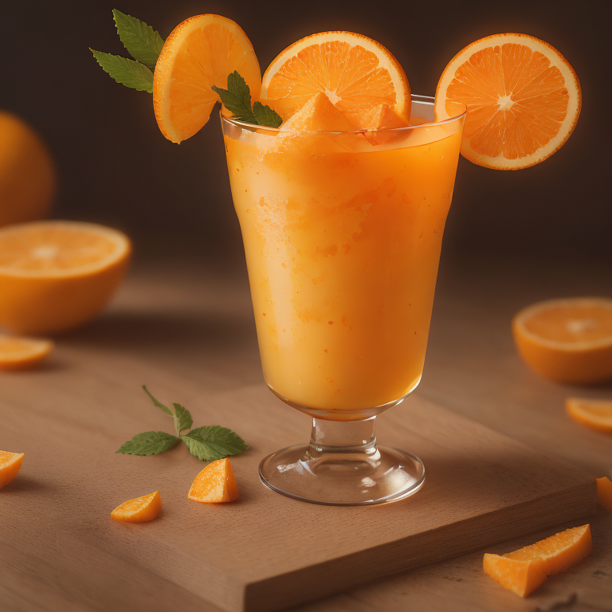</td>
<td align="center"><b>#3</b> 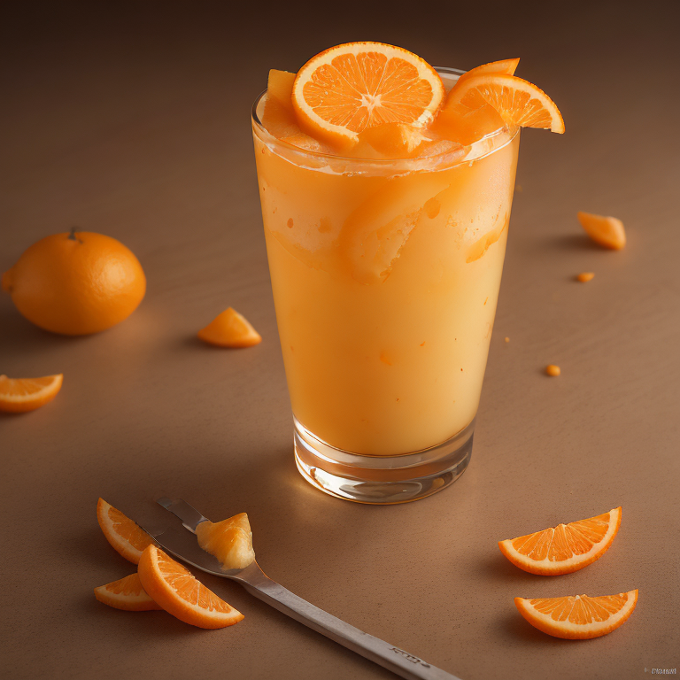</td>
</tr></table>

| Rank | Seed | Iter | Objective | CLIP | LPIPS | RMSE | Prompt |
|---|---|---|---|---|---|---|---|
| 1 | 0 | 1 | +0.292 | 0.932 | 0.457 | 0.183 | there is a glass of orange juice with a slice of orange on the side, unsplash 4k, ps5 render quality, by Antoni Brodowski, post-processing. high detail, soymilk, cgsociety 9, inspired by Perle Fine, high quality topical render, akiman, malt |
| 2 | 2 | 2 | +0.287 | 0.915 | 0.455 | 0.173 | there is a glass of vibrant orange juice with a slice of orange on the side, high detail, unsplash 4k, ps5 render quality, by Antoni Brodowski, post-processing, akiman style, soft natural light, shallow depth of field, cgsociety 9, inspired by Perle Fine's bold colors. |
| 3 | 1 | 3 | +0.259 | 0.926 | 0.470 | 0.198 | a glass of freshly squeezed orange juice with a slice of orange on the side, high detail, unsplash 4k render quality, by Antoni Brodowski, post-processing, soft focus lens, warm golden natural lighting with subtle gradient, fine texture and subtle grain, cgsociety 9, inspired by Perle Fine's abstract expressionism, akiman style, high quality topical render |

### 1159_29.png

<table><tr>
<td align="center"><b>Target</b> 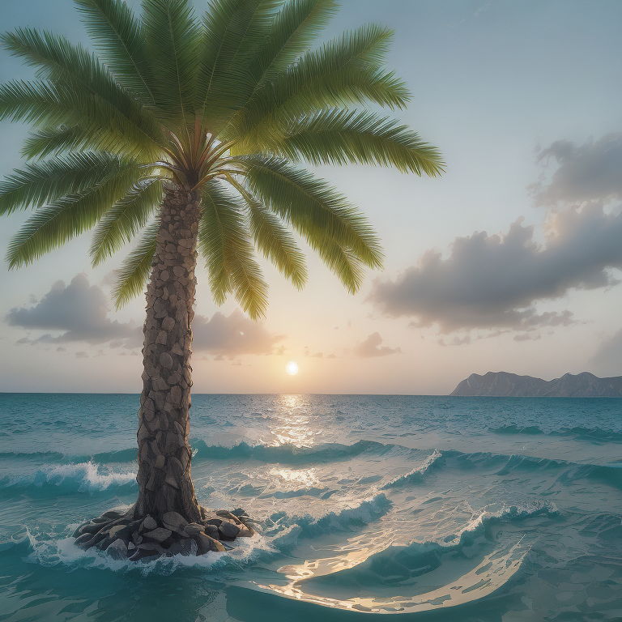</td>
<td align="center"><b>#1</b> 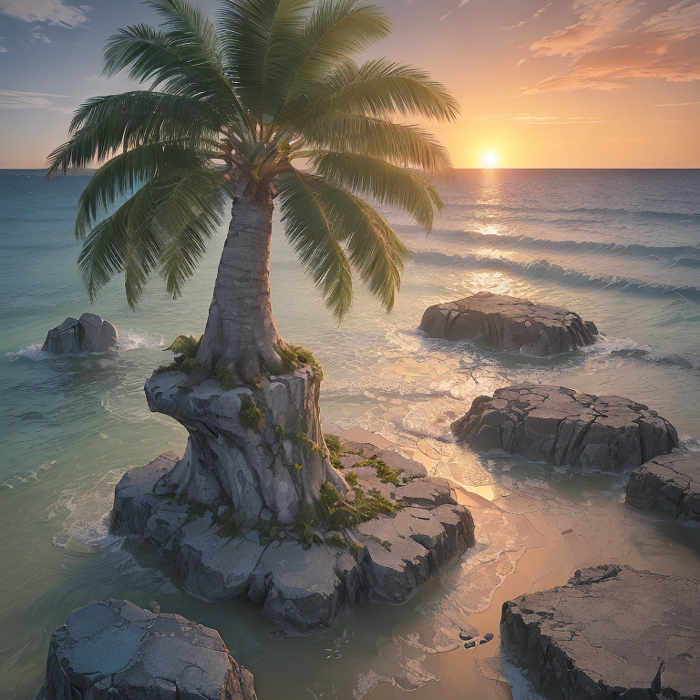</td>
<td align="center"><b>#2</b> 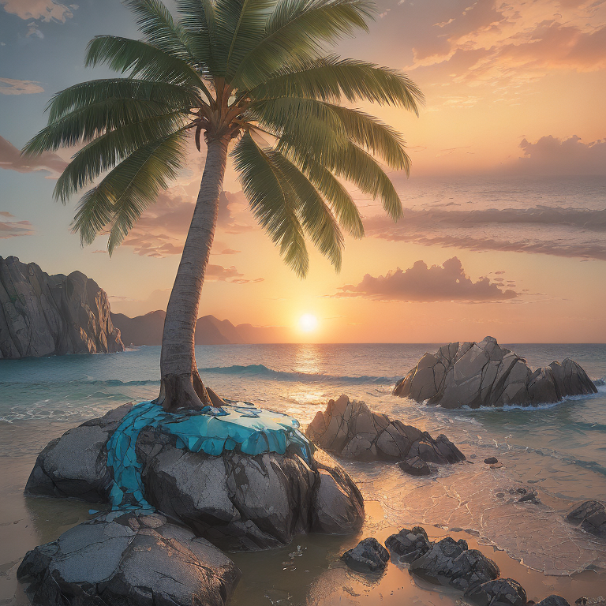</td>
<td align="center"><b>#3</b> 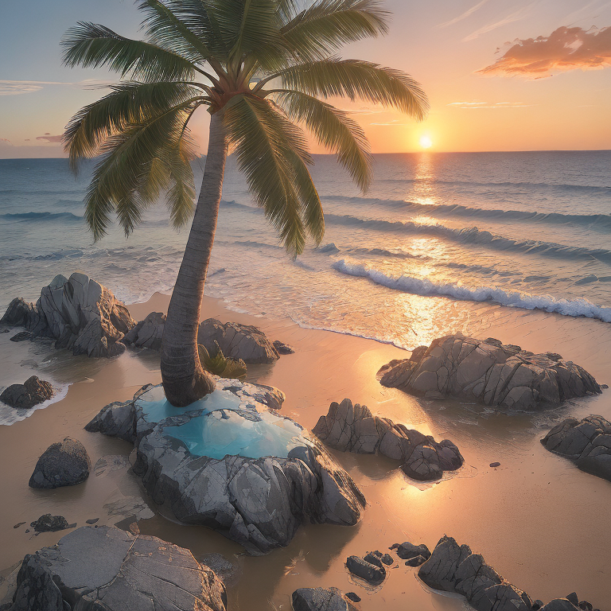</td>
</tr></table>

| Rank | Seed | Iter | Objective | CLIP | LPIPS | RMSE | Prompt |
|---|---|---|---|---|---|---|---|
| 1 | 0 | 1 | +0.156 | 0.933 | 0.578 | 0.199 | arafed palm tree on a rock in the ocean at sunset, adventure hyper realistic render, photoreailstic, an enormous silver tree, puddles of turquoise water, the sun is shining. photographic, long exposure photograph, in matte painting, flooding, inspired by Andrey Esionov, photographic print, high definition photo, old tree |
| 2 | 0 | 2 | +0.147 | 0.905 | 0.562 | 0.196 | enormous silver palm tree on a rock in the ocean at sunset, adventure hyper realistic render, photorealistic, long exposure photograph with vibrant turquoise puddles and warm golden light, inspired by Andrey Esionov's style, high definition photo with subtle texture and depth of field. |
| 3 | 1 | 3 | +0.048 | 0.890 | 0.631 | 0.210 | A majestic silver palm tree stands tall on a rugged rock in the ocean at sunset, with warm golden light casting long shadows and soft focus, vibrant turquoise puddles reflecting the sky's hues, high definition photo with subtle lens flares and gentle overexposure. |

### 1159_3.png

<table><tr>
<td align="center"><b>Target</b> 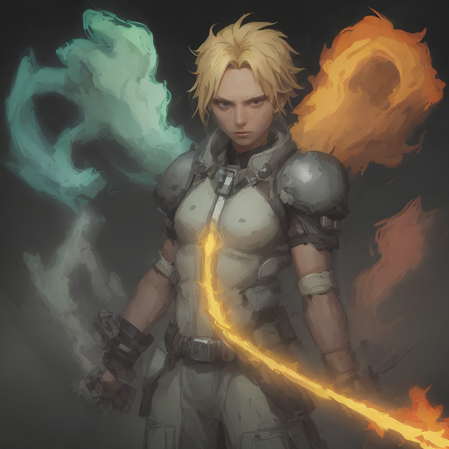</td>
<td align="center"><b>#1</b> 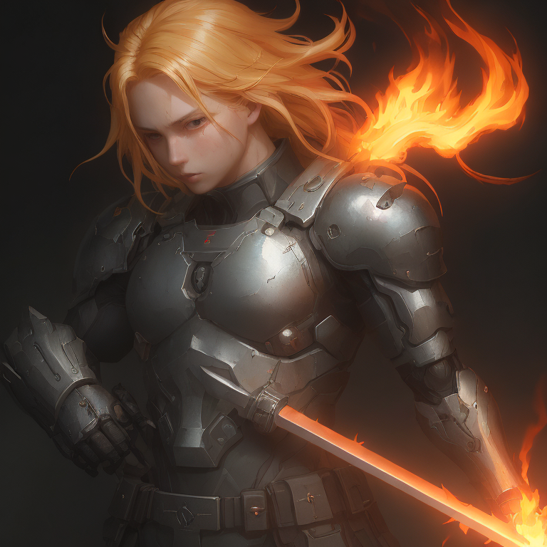</td>
<td align="center"><b>#2</b> 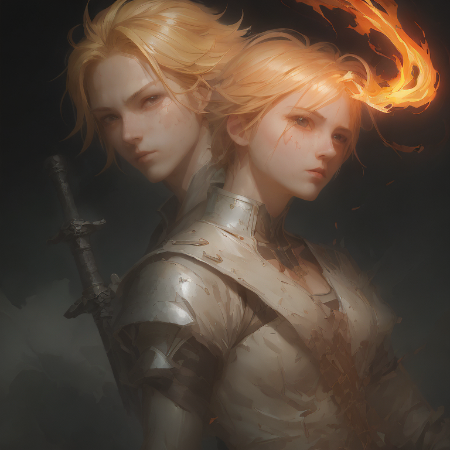</td>
<td align="center"><b>#3</b> 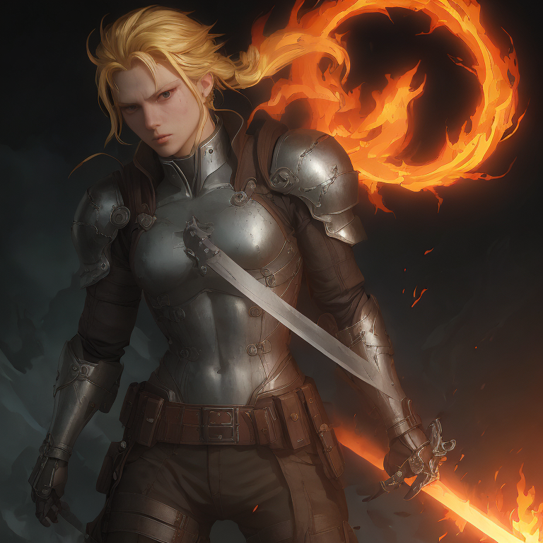</td>
</tr></table>

| Rank | Seed | Iter | Objective | CLIP | LPIPS | RMSE | Prompt |
|---|---|---|---|---|---|---|---|
| 1 | 2 | 2 | +0.183 | 0.842 | 0.477 | 0.182 | Anime character with a sword and flames in hand, trending on ArtStation, glowing effect, inspired by Mandy Jurgens' style of spectral and terada's avatar with blond hair, Joong Keun Lee's influence, test subject supersoldier, soft focus lens, warm color palette, subtle ash and embers surrounding. |
| 2 | 0 | 3 | +0.176 | 0.836 | 0.491 | 0.170 | Anime character with a sword and fire in hand, trending on ArtStation, soft glowing effect, inspired by Mandy Jurgens' spectral colors, Joong Keun Lee's avatar-like texture, Clint Cearley's warm color palette, ash swirling around the subject, blond hair styled like Annie Leonhart's, dynamic lighting reminiscent of terada's style, subtle gradient in background. |
| 3 | 0 | 1 | +0.163 | 0.866 | 0.513 | 0.190 | anime character with a sword and fire in his hand, trending on artstaton, glowing effect, looking like annie leonhart, inspired by Mandy Jurgens, kerberos, spectral, terada, avatar with a blond hair, by Joong Keun Lee, test subject supersoldier, swirls of fire, ash, in the style of clint cearley |

### 1159_7.png

<table><tr>
<td align="center"><b>Target</b> 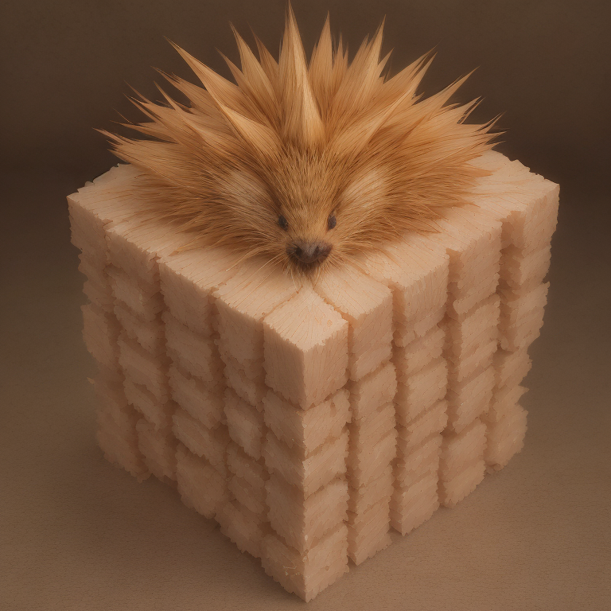</td>
<td align="center"><b>#1</b> 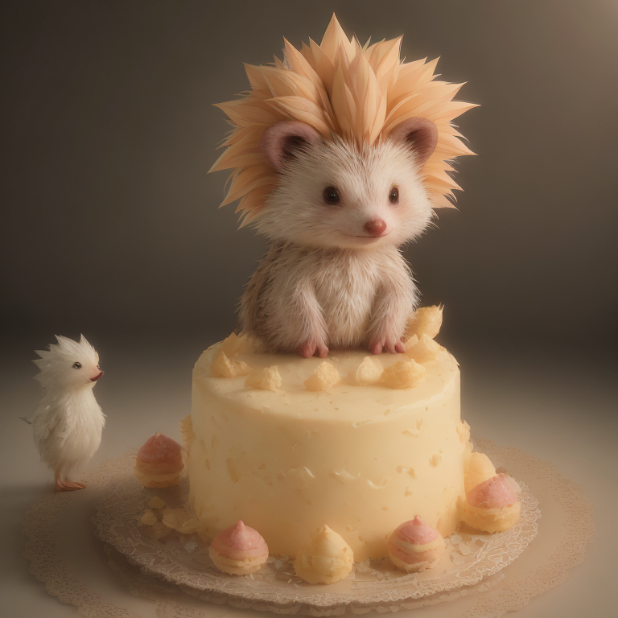</td>
<td align="center"><b>#2</b> 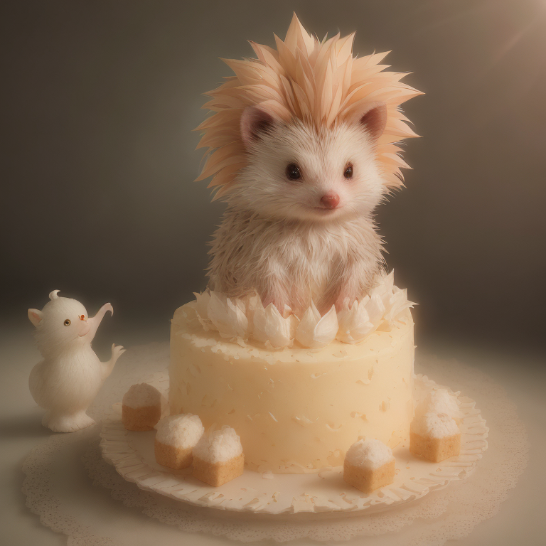</td>
<td align="center"><b>#3</b> 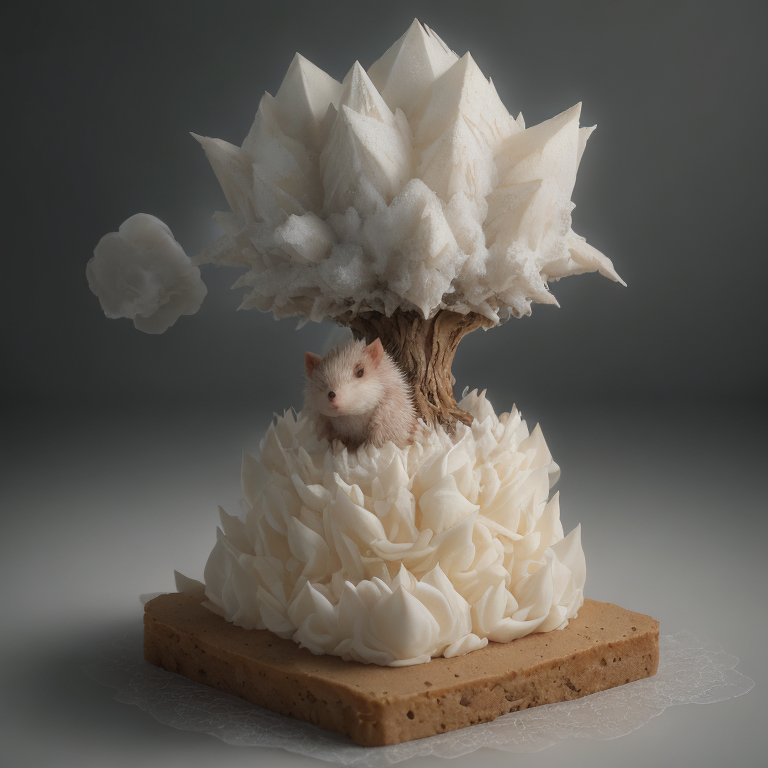</td>
</tr></table>

| Rank | Seed | Iter | Objective | CLIP | LPIPS | RMSE | Prompt |
|---|---|---|---|---|---|---|---|
| 1 | 2 | 3 | -0.102 | 0.601 | 0.534 | 0.169 | there is a small hedgehog sitting on top of a block of cake with feathery fluff and mohawk in warm pastel colors, soft focus, subtle lens flares, nostalgic 1980s crt filter aesthetic, marvelous designer 3d rendered in the style of boris vallego's citrinitas with intricate textures and realistic lighting |
| 2 | 2 | 5 | -0.107 | 0.609 | 0.542 | 0.175 | there is a small hedgehog sitting on top of a block of cake with feathery fluff and mohawk in warm pastel colors soft focus subtle lens flares nostalgic 1980s crt filter aesthetic marvelous designer 3d rendered in the style of boris vallego's citrinitas but with more realistic textures and delicate lighting effects that capture intricate details |
| 3 | 1 | 2 | -0.116 | 0.629 | 0.569 | 0.176 | there is a small hedgehog sitting on top of a block of cake in a warm and soft crt filtered light with feathery fluff and translucent cube background simplicity nimbus cloudy sky marvelous designer 3d rendered boris vallego style fotorealistic moist textures |

### 7836.png

<table><tr>
<td align="center"><b>Target</b> 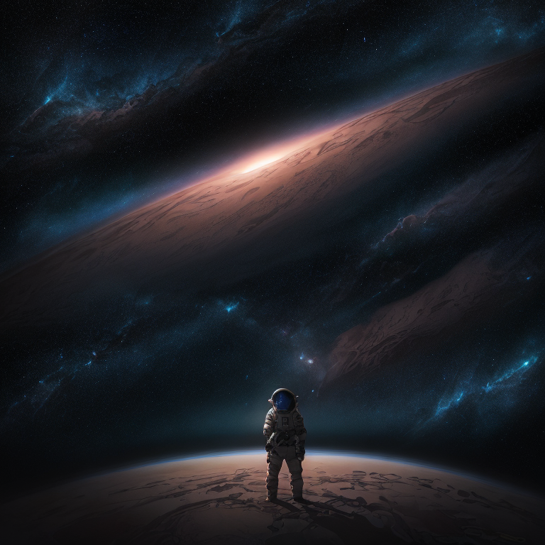</td>
<td align="center"><b>#1</b> </td>
<td align="center"><b>#2</b> </td>
<td align="center"><b>#3</b> </td>
</tr></table>

| Rank | Seed | Iter | Objective | CLIP | LPIPS | RMSE | Prompt |
|---|---|---|---|---|---|---|---|
| 1 | 1 | 2 | +0.328 | 0.886 | 0.419 | 0.138 | Astronaut standing on the alien surface with a radiant solar flare in the background, high-quality digital painting, expansive view of the cosmos, explorers' portrait, soft halo effect, dreamy atmosphere. |
| 2 | 1 | 3 | +0.264 | 0.871 | 0.446 | 0.161 | Astronaut standing on the alien surface amidst a vibrant solar flare with soft, ethereal light and subtle lens flares, high-quality digital painting, expansive view of the cosmos, explorers' portrait, dreamy atmosphere. |
| 3 | 1 | 4 | +0.259 | 0.860 | 0.442 | 0.159 | Astronaut standing on an alien surface amidst vibrant solar flares with soft, warm light and subtle lens flares, high-quality digital painting with rich textures and colors, expansive view of the cosmos in dreamy atmosphere. |

### 9338.png

<table><tr>
<td align="center"><b>Target</b> 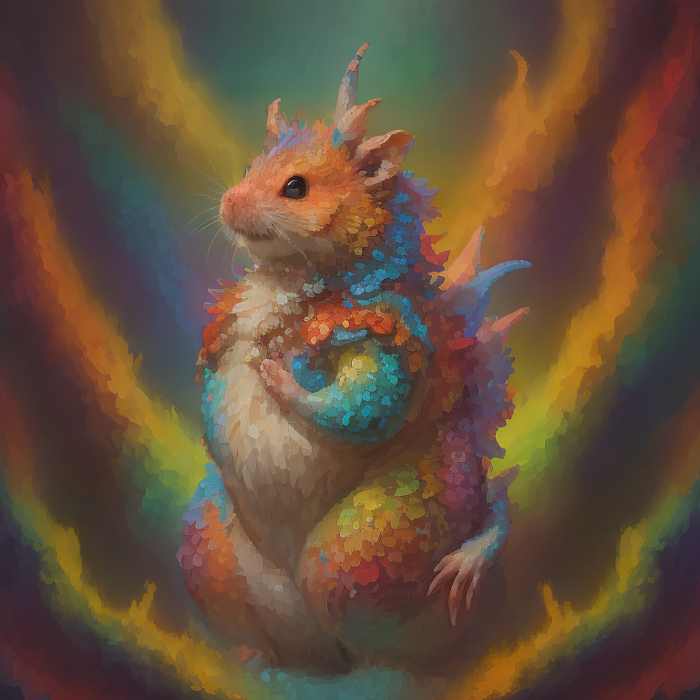</td>
<td align="center"><b>#1</b> 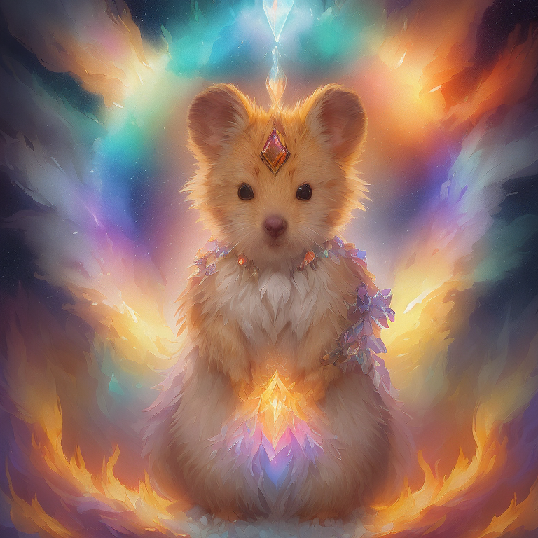</td>
<td align="center"><b>#2</b> 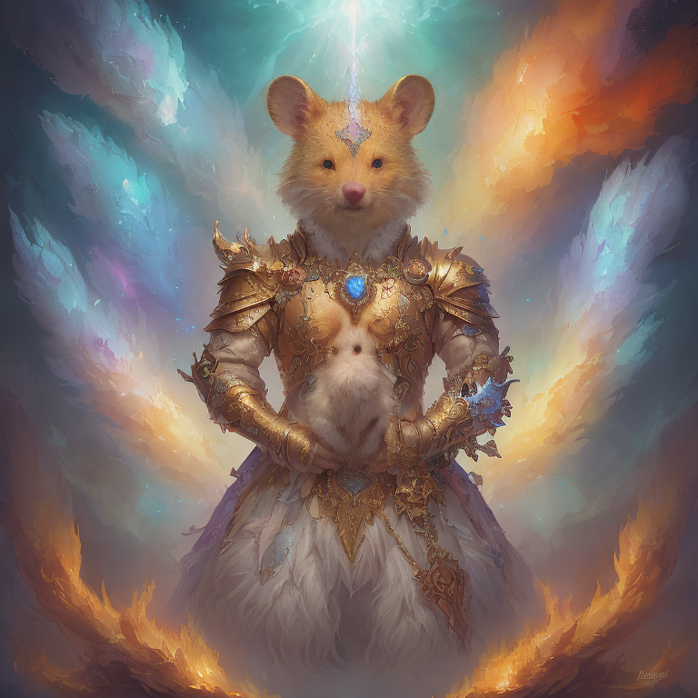</td>
<td align="center"><b>#3</b> 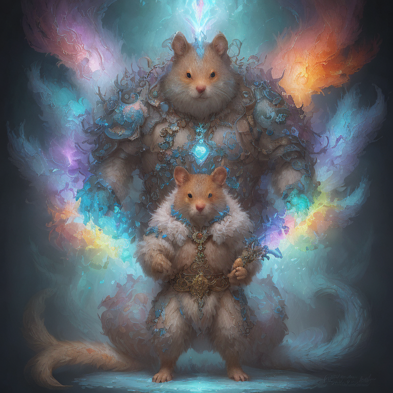</td>
</tr></table>

| Rank | Seed | Iter | Objective | CLIP | LPIPS | RMSE | Prompt |
|---|---|---|---|---|---|---|---|
| 1 | 0 | 4 | +0.151 | 0.813 | 0.446 | 0.217 | painting of a mouse with iridescent crystalline scales and a fluffy multicolored tail in warm golden light reminiscent of Ross Tran's tardigrade, surrounded by soft puffs of colored smoke and a saint's halo, captured with a soft focus lens on a subtle quokka-inspired background |
| 2 | 0 | 3 | +0.117 | 0.787 | 0.469 | 0.200 | painting of a mouse with iridescent crystalline scales and a fluffy multicolored tail, inspired by Chris Rahn's style, in the warm golden light of Ross Tran's tardigrade, surrounded by soft puffs of colored smoke, saint's halo, quokka, full art by Olha Darchuk, captured with a soft focus lens |
| 3 | 0 | 1 | +0.035 | 0.776 | 0.546 | 0.195 | painting of a mouse with a colorful tail and tail, inspired by Chris Rahn, crystalized scales, npc with a saint\'s halo, colossal fluffy tardigrade, in the style of ross tran, the squirrel king, full art, by Olha Darchuk, puffs of colored smoke, quokka, furry fluffy iridescent dragon |

